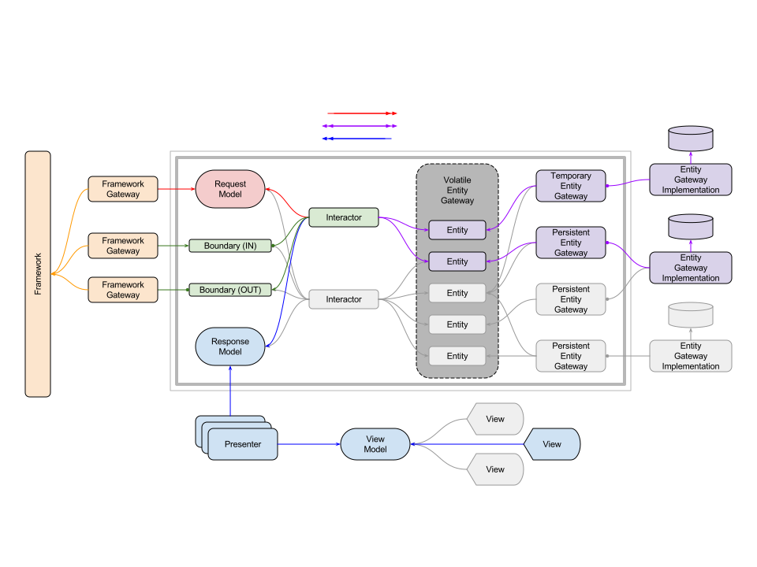

# applicationArchitecture
> A PHP implementation of the Architecture design by Uncle Bob

[Uncle Bob Martin](http://cleancoder.com) presents a software architecture
pattern which moves the business logic front-and-center; and the framework,
database, and delivery methods as plug-ins.  This project contains both a
diagram of an implementation of this architecture, a sample directory
structure, as well as the interfaces needed to implement this architecture in a
future project.  

[](architecture.svg)
[](architecture.png)

## Installing / Getting started

This project has no dependencies, so can be cloned directly from the git repo

### Require with Composer

```shell
composer require emeraldinspirations/lib-applicationarchitecture
```

## Documentation
Further documentation is available thanks to [phpDocumentor2](https://www.phpdoc.org/) and [PHPDocumentor Markdown generator](https://github.com/evert/phpdoc-md):

- [Documentation](phpdoc/md/ApiIndex.md) (Not yet generated)

## Contributing

If you'd like to contribute, please fork the repository and use a feature branch.

I am also open to feedback about how well I am being compliant with standards
and "best practices."  I have written software solo for years, and am trying to
learn how to work better with others.

## Licensing

The code in this project is licensed under [MIT license](LICENSE).
